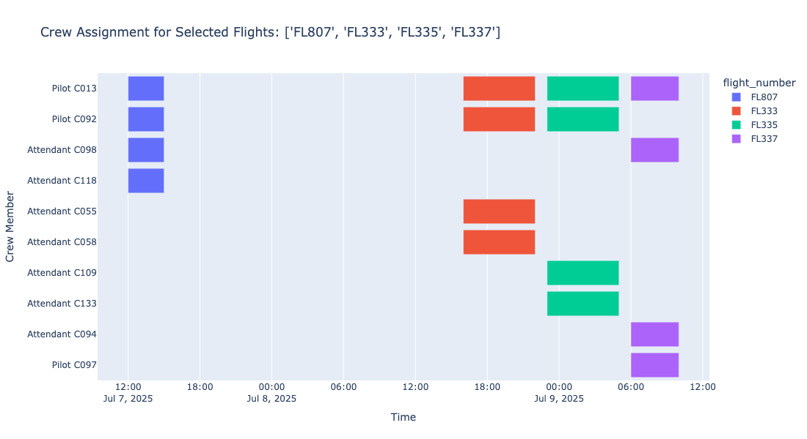

# Crew Scheduling Optimization for Reliable Airline Operations

Efficient crew scheduling is a large-scale combinatorial optimization problem that can be formulated as a Mixed Integer Linear Program (MILP).

This section presents the full mathematical formulation.

---

# 1️⃣ Problem Definition

Let:

- \( C \) = set of crew members  
- \( F \) = set of flights  
- \( R \) = set of crew roles (Captain, FO, FA)  
- \( B \) = set of crew bases  

Each flight \( f \in F \) has:
- Start time \( s_f \)
- End time \( e_f \)
- Required crew by role \( d_{fr} \)

Each crew member \( c \in C \) has:
- Role \( r(c) \)
- Base \( b(c) \)
- Qualification set \( Q_c \)
- Maximum duty hours \( H_c \)
- Monthly credit limit \( M_c \)

---

# 2️⃣ Decision Variable

\[
x_{cf} =
\begin{cases}
1 & \text{if crew } c \text{ is assigned to flight } f \\
0 & \text{otherwise}
\end{cases}
\]

Binary variable:
\[
x_{cf} \in \{0,1\}
\]

---

# 3️⃣ Objective Function

Typical objective: minimize total crew assignment cost.

\[
\min \sum_{c \in C} \sum_{f \in F} c_{cf} x_{cf}
\]

Where:

- \( c_{cf} \) = cost of assigning crew \( c \) to flight \( f \)

Alternative objective: maximize utilization:

\[
\max \sum_{c \in C} \sum_{f \in F} u_f x_{cf}
\]

---

# 4️⃣ Constraints

---

## 4.1 Flight Coverage Constraint

Each flight must have required crew for each role:

\[
\sum_{c \in C_r} x_{cf} = d_{fr}
\quad \forall f \in F, \forall r \in R
\]

Where:
- \( C_r \subseteq C \) = crew members with role \( r \)

---

## 4.2 No Overlapping Flights

If two flights \( f_1, f_2 \) overlap:

\[
s_{f_1} < e_{f_2} \quad \text{and} \quad s_{f_2} < e_{f_1}
\]

Then:

\[
x_{cf_1} + x_{cf_2} \le 1
\quad \forall c \in C
\]

Prevents simultaneous assignments.

---

## 4.3 Duty Time Constraint

Let:

- \( T_{cf} \) = duration of flight \( f \)
- \( G_{f_1f_2} \) = ground time between connected flights

Total duty time for crew \( c \):

\[
\sum_{f \in F} T_{cf} x_{cf} \le H_c
\quad \forall c \in C
\]

---

## 4.4 Minimum Rest Constraint

For consecutive duties:

If flight \( f_1 \) precedes \( f_2 \), then:

\[
s_{f_2} - e_{f_1} \ge R_{\min}
\]

Otherwise:

\[
x_{cf_1} + x_{cf_2} \le 1
\]

Ensures minimum rest window.

---

## 4.5 Base Constraint

Crew must start and end at base.

Let:

- \( O_f \) = origin airport
- \( D_f \) = destination airport

Feasible pairing must satisfy:

\[
O_{f_1} = b(c)
\]

\[
D_{f_k} = b(c)
\]

Enforced via pairing generation or network flow constraints.

---

## 4.6 Qualification Constraint

Crew can only operate flights for which they are certified:

\[
x_{cf} \le q_{cf}
\quad \forall c,f
\]

Where:

\[
q_{cf} =
\begin{cases}
1 & \text{if crew } c \text{ is qualified for flight } f \\
0 & \text{otherwise}
\end{cases}
\]

---

## 4.7 Monthly Credit Limit

\[
\sum_{f \in F} T_{cf} x_{cf} \le M_c
\quad \forall c \in C
\]

Prevents excessive credit accumulation.

---

## 4.8 Connectivity Constraint

If flight \( f_2 \) follows \( f_1 \):

\[
D_{f_1} = O_{f_2}
\]

\[
s_{f_2} - e_{f_1} \ge \text{Minimum Turnaround}
\]

Otherwise:

\[
x_{cf_1} + x_{cf_2} \le 1
\]

---

# 5️⃣ Compact MILP Form

\[
\min \sum_{c,f} c_{cf} x_{cf}
\]

Subject to:

- Flight coverage
- Overlap constraints
- Duty limits
- Rest limits
- Qualification limits
- Credit limits
- Base feasibility

\[
x_{cf} \in \{0,1\}
\]

---

# 6️⃣ Model Strength

This MILP:

- Guarantees legal schedules  
- Enforces global consistency  
- Handles thousands of flights  
- Evaluates millions of feasible combinations  

Solvers used:

- Gurobi  
- CPLEX  
- OR-Tools  
- CBC  

---

# 7️⃣ Strategic Impact

Embedding regulatory and fatigue rules directly into the mathematical model ensures:

- Lower cancellation risk  
- Improved cost efficiency  
- Transparent decision logic  
- Faster recovery from disruptions  

Crew scheduling thus transitions from manual planning to formal network optimization.

---

# 8️⃣ Sample Results

This section of the write-up explains how optimization is beneficial in solving the crew scheduling problem. It also presents an overview of the conceptual model that provides a global lens on the problem space, the required data structures, and the solution engine that ultimately generates the optimized schedule.
To understand the charts shown later, it is essential to first understand how the inputs flow through the optimization pipeline. Crew scheduling is not a matter of manually assigning flights—it is a structured computational process that evaluates thousands of constraints, regulatory rules, and pairing patterns before producing a feasible and cost-efficient roster.
The optimization journey begins with the two foundational datasets:
Flight Schedule (times, routes, aircraft assignments).
Crew Profiles (bases, qualifications, duty limits, fatigue rules, priority preferences).
These datasets collectively describe the operational environment: which flights must be covered, which crew members are eligible, and what legal or contractual boundaries must be respected.
Regulatory rules—duty/rest requirements, fatigue management standards, maximum hour limits—are then layered onto these data inputs. These rules shape a feasibility sequence, which determines which flights can legally connect, which duties can be constructed, and which pairings are possible.
Only after feasibility is established does the optimization engine begin solving. Your conceptual model captures this clearly:
 Data inputs → Feasibility generation → Optimization core → Operational outputs.
Within the optimization engine, several tightly integrated modules evaluate millions of potential combinations:
Flight Scheduling – ensuring every flight has the correct mix of qualified crew
Crew Pairing – building multi-day legal duty sequences
Crew Rostering – assigning pairings to individual crew members while balancing cost, utilization, fairness, and limits
The solver navigates this enormous combinatorial landscape to produce the most efficient roster that satisfies all rules and minimizes operational cost.
The result of this process is distilled into two essential output structures:
Assignment Matrix – a structured representation showing which crew member operates which flight and when (used to create the Gantt-style duty charts)
Co-occurrence Sequence – a relational matrix showing how frequently crew members operate together (used for the co-flight heatmap)
Following are some of the standard outputs from the constraint satisfaction solution approach.

The Gantt chart offers a timeline-like snapshot of how individual crew members are deployed across the day. Each bar captures a flight that a crew member is assigned to, showing when their duty begins and ends. When seen together, these bars form a visual story of the roster: who is flying, when they are on duty, and how their workday is structured.
One of the immediate observations from the chart is how the model naturally spaces out the duties to avoid overlapping assignments. Crew with tightly packed segments reflect higher utilization, while those with longer gaps indicate potential inefficiencies or reserve periods. As you scan across the chart, patterns emerge—some crew have smoother sequences of flights, while others have fragmented duties, revealing opportunities for improving continuity in pairings. Overall, this chart helps validate the feasibility of the schedule and gives a real sense of how the crew day actually unfolds.

---

# 🏁 Conclusion

Crew scheduling is fundamentally a binary assignment optimization problem with complex temporal, regulatory, and qualification constraints.

A properly formulated MILP provides:

- Feasible schedules  
- Cost-optimal assignments  
- Resilient operations  
- Scalable workforce planning  

In modern aviation systems, optimization is not an enhancement — it is infrastructure.
